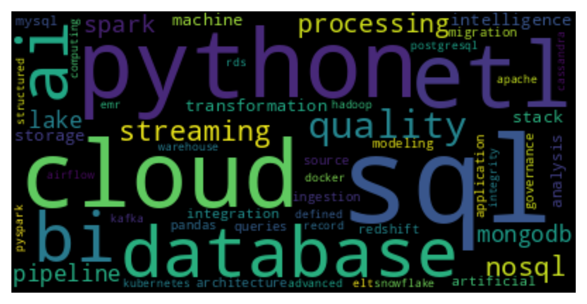

# Web Scraping LinkedIn Project: most common technical words related for Jr. Data Engineer works (wordcloud)
##### **#regex #requests #bs4 #pandas #matplotlib #wordcloud**
\
¿Cómo lo hacemos?
 - Obtenemos las palabras presentes en las búsquedas de trabajo **junior data engineer** en LinkedIn. Se puede elegir el país y la cantidad de páginas (LinkedIn tiene 25 postulaciones por páginas, no todas son *Junior*).
- Internamente obtenemos las palabras técnicas claves para hacer el filtrado (*el paso previo obtuvo todas las palabras*) de diversas páginas [1](https://www.silect.is/blog/data-engineering-glossary/) [2](https://towardsdatascience.com/complete-data-engineers-vocabulary-87967e374fad) [3](https://www.trifacta.com/data-engineering-glossary/#:~:text=Data%20Engineers%20are%20the%20individuals,store%2C%20manage%2C%20...)  .
-  Una vez realizado el filtrado (con algunas etapas de cleaning previas) visualizamos a través de wordcloud

La siguiente es una wordcloud obtenida para **España** buscando en 40 páginas *(461 postulaciones para Jr)*. 

